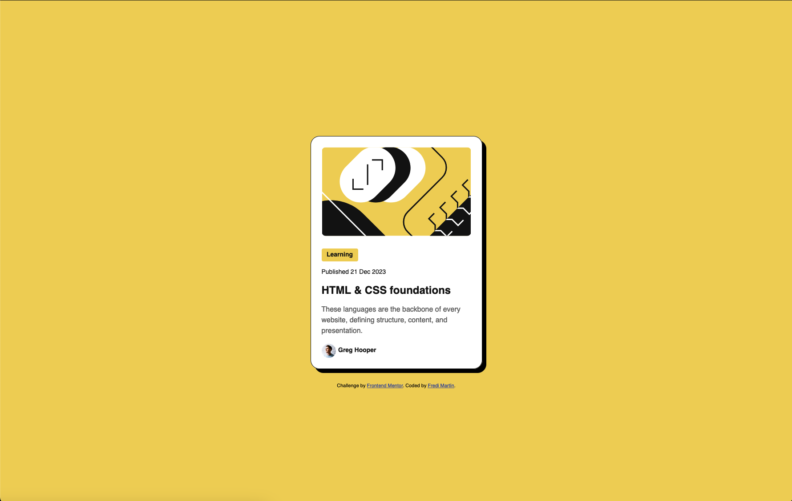

# Frontend Mentor - Blog preview card solution

This is a solution to the [Blog preview card challenge on Frontend Mentor](https://www.frontendmentor.io/challenges/blog-preview-card-ckPaj01IcS). Frontend Mentor challenges help you improve your coding skills by building realistic projects. 

## Table of contents

- [Overview](#overview)
  - [The challenge](#the-challenge)
  - [Screenshot](#screenshot)
  - [Links](#links)
- [My process](#my-process)
  - [Built with](#built-with)
  - [What I learned](#what-i-learned)
  - [Continued development](#continued-development)
- [Author](#author)

**Note: Delete this note and update the table of contents based on what sections you keep.**

## Overview

### The challenge

Users should be able to:

- See hover and focus states for all interactive elements on the page

### Screenshot



### Links

- Solution URL: [Add solution URL here](https://your-solution-url.com)
- Live Site URL: [Add live site URL here](https://your-live-site-url.com)

## My process

### Built with

- Semantic HTML5 markup
- CSS custom properties
- Flexbox

### What I learned

I learn about use box-shadow for container

```css
.container{
    width: 384px;
    height: 522px;
    background-color: #FFFFFF;
    border-radius: 20px;
    margin-bottom: 2rem;
    border: 1px #111111 solid;
    box-shadow: 9px 9px 0px rgba(0, 0, 0, 1)
}
```
### Continued development

I'm focusing practice and be familiar with css propierties

## Author

- Frontend Mentor - [@fmartinmora](https://www.frontendmentor.io/profile/fmartinmora)
- Twitter - [@fmartinmora](https://www.twitter.com/fmartinmora)
- Linkedin - [@fredi-martin](https://www.linkedin.com/in/fredi-martin/)
